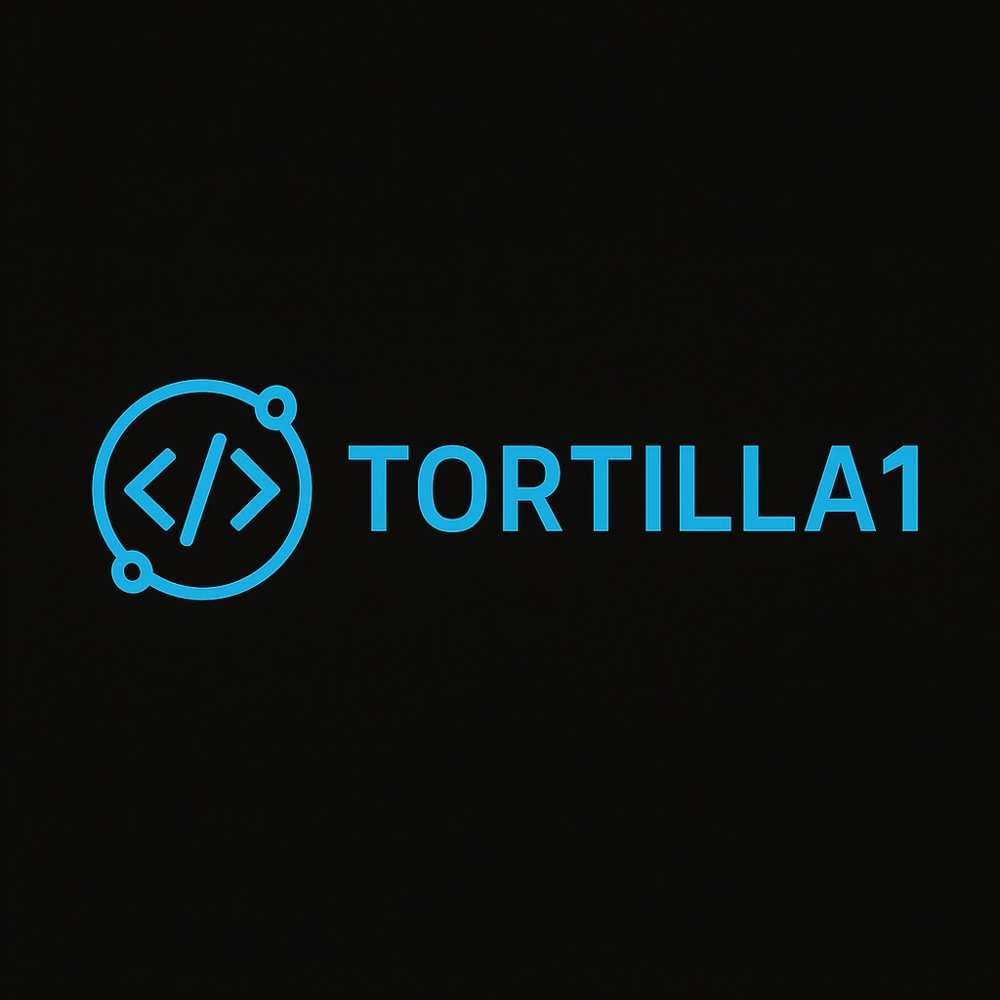

  

<h1 align="center">
  Eltortilla1 | Founder of <a href="https://discord.gg/BVyafZaNdw" target="_blank">Tortilla Scripts</a>
</h1>

<i>"No vine a ser una más. Vine a ser referente."</i>

  
  
  

---

## 🛠️ Tecnologías y herramientas

  

---

## ⚙️ Proyectos destacados

| Proyecto             | Descripción                                            | Tecnologías                         |
|----------------------|--------------------------------------------------------|-------------------------------------|
| 🔥 **Meta(LITE)**      | Sistema de cocinado de metanfetamina modular y visual. | `Lua`, `HTML`, `JavaScript`, `CSS`  |
| 🚀 **Workplus(LITE)**  | Sistema de trabajo 100% modular y configurable.        | `Lua`, `HTML`, `JavaScript`, `CSS`  |

